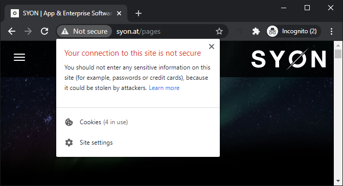

# Softwareentwickler, Senior

Ausgeschrieben auf [karriere.at](https://www.karriere.at/jobs/5772741)  am 25.12.2020 (s. [Druckversion](media/softwareentwickler_karriere.at.pdf)) sowie [syon.at](http://www.syon.at/pages/careers) (als *Frontend Entwickler*; s. [Druckversion](media/frontend-entwickler_syon.at.pdf))

## Anschreiben

Sehr geehrte Frau Pirchheim,

> Du bist ein/e begeisterte/r Softwareentwickler*in und kannst es kaum erwarten, dein Können in die Entwicklung **innovativer Produkte** einzubringen?

ich bin ein Softwareentwickler mit [Erfahrung](https://github.com/235u/proposals/blob/master/EzparkTechnology/docs/competence.md); gerne versuche ich mein [Können](https://observablehq.com/@nikita-sharov/publications) (zumindest *konzeptionelle sowie analytische Fähigkeiten*) gleich unter Beweis zu stellen:

> Konzeption, Entwicklung und Wartung von **kundenspezifischen Web-Applikationen**

In der Softwareentwicklung wird üblicherweise zwischen Produkt- und [Projekt-Geschäft](http://www.syon.at/pages/portfolio) unterschieden: So werden die Entwicklungskosten bei einem Produkt auf mehrere Kunden verteilt, die eine höhere Last tragen können, was sich in der Qualität und/oder Funktionsumfang   wiederspiegelt.

> Unterstützung interner und externer Anwender*innen

Weiters wird zwischen System- und Anwendungssoftware unterschieden (wobei die Grenzen verschwimmen): Für die Softwareentwickler stellt Systemsoftware ein Werkzeug dar, um damit Werkzeuge für die externen Anwender zu entwickeln (und darauf zu betreiben). Immer wieder sind die Softwareentwickler mit dem vorhandenen Werkzeug nicht zufrieden und entwickeln ihr eigenes oder passen bestehendes an. So werden sie zu internen Anwendern ihrer selbst-entwickelter bzw. -angepasster Software. Dabei wird oft das Rad neu erfunden, was lehrreich sowie interessant sein kann. Hin und wieder entsteht dabei etwas Brauchbares, auch für externe Anwender.

So wird es bei *kundenspezifischen Web-Applikationen*, die als Anwendungssoftware eingestuft werden, sofern die Kunden keine Software-Entwickler oder -Betreiber sind, kaum SYON-interne Anwender geben.

> SYON ist eine innovative Softwareagentur in Graz

Nachdem nicht alle Kunden innovativ sind, kann auch eine bestehende kundenspezifische Web-Anwendung für andere Kunden interessant und damit zu einem Produkt werden.

HTTPS / SSL gelten schon länger als Standard.

> Wir entwickeln Enterprise-Software, SaaS Produkte sowie Apps

Übersetzt: Wir entwickeln Software(-Anwendungen) für Unternehmen, die wir auch  vermieten, sowie (Software-)Anwendungen für mobile Geräte.

Bei **S**oftware **a**s **a** **S**ervice spricht man eher von Dienstleistungen.

Mit freundlichen Grüßen,  
Nikita Sharov
